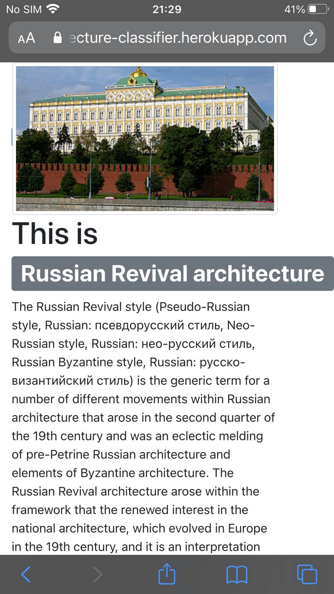
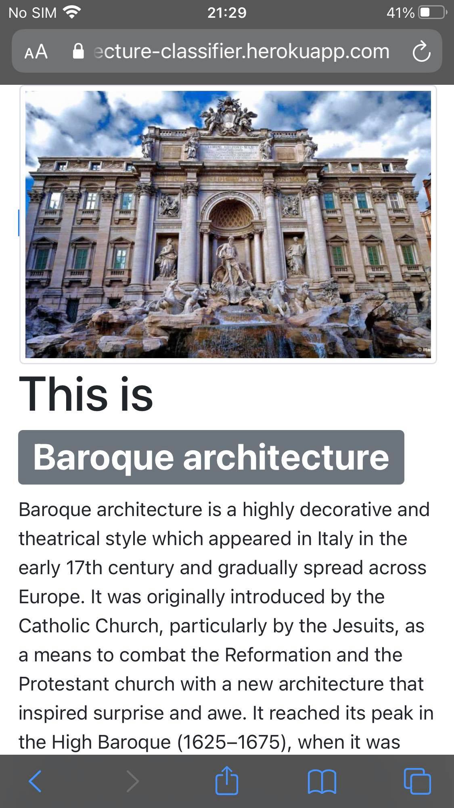
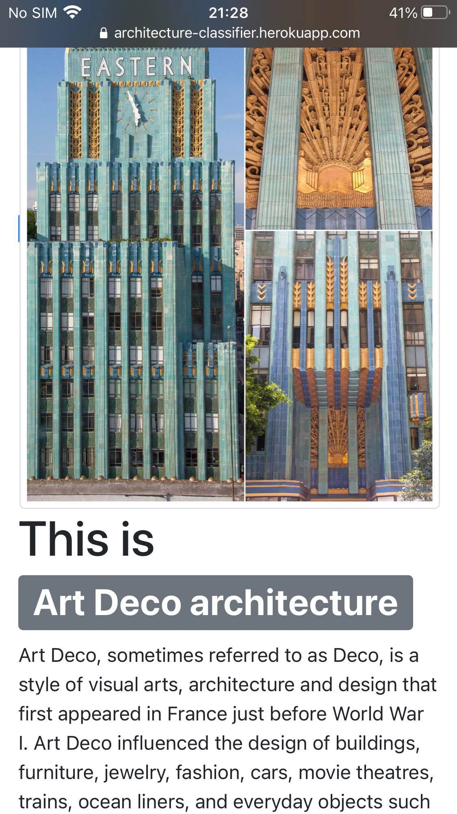

# [Architecture style Classifier](https://indzhov.github.io/Architecture-style-DL) 
[(the code)](https://github.com/indzhov/Architecture-style-DL) 

This is my final project for the Deep Learning course, provided by SoftUni Bulgaria. It is trying to build an web app, which receives building photos from your phone or taken in real time and give you the information about their architectural style.  This project is motivated from my passion about the architecture as a whole. It is delivered not only with the skills learned from SoftUni, but also with my Art history skills, which helped me to clean the data. It is manualy checked and cleaned to be in the perfect condition, which give me the confidence to claim that there is no better data set for similar project on the network right now. 

The app could be found [(here)](https://architecture-classifier.herokuapp.com) 

Some examples of the final results : 

# The Project
1 - Gathering of the data : 
  A/ The data from the official [(paper)](https://opus.lib.uts.edu.au/bitstream/10453/122547/1/Architectural%20Style%20Classification%20using%20Multinomial%20Latent%20Logistic%20Regression.pdf) for such projects by Zhe Xu.
  B/ Google images from [(paper)](https://www.kaggle.com/dumitrux/architectural-styles-dataset) Kaggle repository by Marian Dumitrus 
  C/ My own scrapping from Bing search - the process and library could be found in my first notebook of this project
  
  The whole cumulative data is stored [(here)](https://drive.google.com/drive/folders/1bGSBr9PDV_Wh5xoRhOQITLtrlxjWSKvK?usp=sharing)
  Please not that I used my background knowledge to check the dataset. Thus, the images are perfectly separated in their respective folder. 
  
2 - Visualization (EDA) : 

  - American Foursquare architectures and American craftsman style are very similar to each other. 
  - Baroque architecture and Beaux-Arts architecture are easily confused. 
  - Deconstructivism has very distinct features, compared to the other architectures, thus it could be easily recognized .
  
3 - Preprocessing the data:
  Here I transformed the images into the perfect format for later modeling. 
  
4 / 5 - In the following two notebooks I used Transfer Learning, training the model with ResNet50 and InceptionV3.
The stronger was ResNet, thus I made the next step with it (the creation of the app)

You can see the app [(here)](https://architecture-classifier.herokuapp.com)
  
